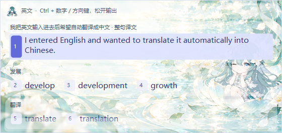
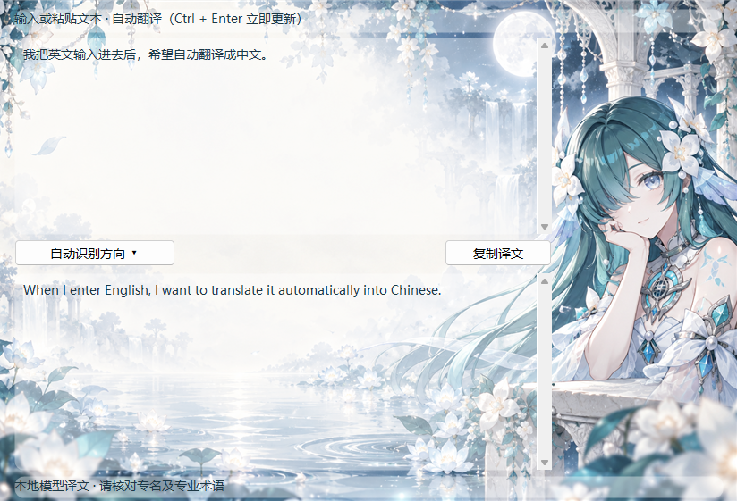
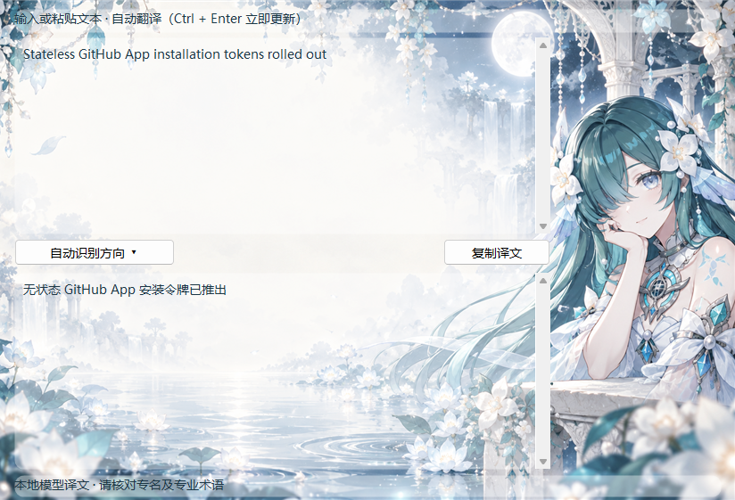

<div align="center">


# EnglishAssistant

**继续使用微软拼音，让中文候选直接输出为英文。**

离线英文选词 · 双向自动翻译 · 可自定义背景


[下载完整 Windows 版](https://github.com/YYHSSR/EnglishAssistant/archive/refs/heads/main.zip) · [快速开始](#快速开始) · [使用说明](使用说明.md) · [许可与来源](#许可与来源)

</div>

## 功能预览

<table>
  <tr>
    <th>英文候选：整句优先，单词按中文分组</th>
    <th>双向翻译：输入后自动更新，可一键复制</th>
  </tr>
  <tr>
    <td width="46%"><a href="resources/screenshots/candidates.png"></a></td>
    <td width="54%"><a href="resources/screenshots/translation.png"></a></td>
  </tr>
</table>

| 功能 | 使用体验 |
| --- | --- |
| 微软拼音联动 | 保留原有中文输入方式，英文面板显示在中文候选附近 |
| 整句优先 | 未命中的较长中文候选由本地模型翻译，完整译文排第一 |
| 多种英文释义 | 同一中文词横向分组，空间不足时自动换行；例如 develop / development / growth |
| 双向自动翻译 | 英文 ↔ 中文，输入或粘贴后自动翻译，也可固定方向 |
| 主题背景 | 两张沃雅妮莎主题背景，支持替换图片、GIF、视频及调整白底透明度 |
| 开机自启动 | 托盘勾选即可启用，移动完整目录后自动更新启动路径 |

## 快速开始

**适用于 Windows 10 / 11 x64，搭配微软拼音。**

1. [下载完整项目 ZIP](https://github.com/YYHSSR/EnglishAssistant/archive/refs/heads/main.zip)，解压到自己的文件夹。
2. 双击根目录 `EnglishAssistant.exe`，任务栏托盘出现头像。
3. 切到微软拼音中文模式，输入拼音；先不要按空格提交中文。
4. 查看英文面板，**按住 Ctrl → 按编号 → 松开 Ctrl 输出英文**。

也可以克隆后直接运行：

```powershell
git clone https://github.com/YYHSSR/EnglishAssistant.git
cd EnglishAssistant
.\EnglishAssistant.exe
```

无需自行安装 Python、配置翻译 API 或准备显卡。模型和运行库随仓库提供，首次翻译从本地压缩包解压运行库，不会联网下载。

> 移动时请移动**整个文件夹**，保留 `data`、`models`、`runtime`、`translation`、`resources` 与许可文件，不能只复制 exe。个人设置在 `settings.ini`，个人词表在 `personal.tsv`。

## 打字时选择英文

| 操作 | 效果 |
| --- | --- |
| 按住 Ctrl，再按 1–9 | 选择英文面板对应编号 |
| 按住 Ctrl，按 ↓ / → | 选择下一条，可跨页 |
| 按住 Ctrl，按 ↑ / ← | 选择上一条，可跨页 |
| 松开 Ctrl | 输出当前选中的英文 |
| 点击英文条目 | 直接输出该条英文 |

按住 Ctrl 时可继续换选，编号保持稳定，无需 Shift。编号以**英文面板**为准，与微软中文候选编号可能不同。

词语优先查本地词库；最长中文候选达到 4 字且未命中时，停顿约 0.35 秒后开始异步模型翻译。模型结果就绪后标为 **整句译文**，排在单词候选之前。推理期间，已有单词释义仍可选择。不完整的词典拼接结果不会进入可输出候选。

例如：

| 输入中文 | 英文候选示例 |
| --- | --- |
| 发展 | develop · development · growth |
| 你来自哪里 | Where are you from? |
| 我把英文输入进去后希望自动翻译成中文 | I entered English and wanted to translate it automatically into Chinese. |

**表达整句话时，建议先完成整句的拼音输入，再选择英文。** 助手只读取当前未提交的中文候选；逐词输出的英文缺少完整上下文，不能自动重组成连贯段落。写长段落时使用下方的双向翻译框更方便。

面板优先放在中文候选上方，预留拼音行与间距；空间不足时自动减少条目、分页或移到下方。同一中文词的不同释义放在同组内，按可用宽度换行。

## 双向自动翻译框

右键托盘 → **双向自动翻译框**。

1. 在上框输入或粘贴英文、中文。
2. 停止输入约 **0.6 秒**，下框自动显示译文；也可按 **Ctrl + Enter** 立即更新。
3. 点击 **复制译文**，或选中所需内容后按 Ctrl + C。

默认按中英文字符比例识别方向。点击 **自动识别方向 ▾**，可以固定为英文 → 中文或中文 → 英文，适合混合语言内容。

翻译期间仍可编辑输入；新内容会取消旧请求，过期结果不会覆盖最新译文。删除全部输入会清空结果。模型按句处理并保留段落，每次最多 **8000 字符**。

<details>
<summary>查看英文 → 中文界面</summary>



</details>

## 背景与托盘设置

右键托盘可暂停英文候选、开启自启动、打开翻译框、分别设置两个窗口的背景或退出。

- **翻译框背景…**：默认“月下水庭”。
- **英文选词框背景…**：默认“晨光涟漪”。
- 点击选择文件，或直接拖入设置窗口。支持 PNG / JPG / BMP / GIF，以及系统可解码的视频；推荐 H.264 MP4。
- **文字区域白底**：0% 完全透明，100% 纯白，默认 40%；两个窗口分别保存、立即生效，文字本身不会变淡。
- 视频默认静音，可勾选播放声音；设置预览始终静音，窗口隐藏时暂停播放。

设置窗口完整预览图片，比例不同时留边；实际窗口按比例铺满，可能裁去边缘。静态图片不启用刷新定时器；调透明度不会重载媒体或重启视频。自定义媒体副本在 `backgrounds/custom`，不提交到仓库。

## 离线运行与常见问题

**为什么整句不再依赖词库拼接？**

词库适合单词、多种释义和固定短句；“把”等语法词需要结合整句处理。程序使用 OPUS 英中、中英两个本地 Transformer 模型，SentencePiece 分词，CTranslate2 int8 CPU 推理。两份权重合计约 160 MB，Windows 运行库压缩约 60 MB。精确本地词条优先，其他句子交给模型处理。

**会联网、收费或限制次数吗？**

运行时不调用翻译 API，不需要账号或密钥，没有服务额度或次数限制。CPU 与内存由本机提供；首次加载模型可能稍慢。闲置约 60 秒后释放推理进程，窗口关闭或程序退出时取消任务并回收进程。

**是否保存输入或自动读取剪贴板？**

默认不记录输入日志，不上传文本，不自动监视剪贴板；仅在你粘贴或复制时使用剪贴板。候选模型最多缓存 64 项结果，保存在内存中，退出程序清空。个人词表、配置和自定义背景不提交到 Git。

**模型能保证任何句子都准确吗？**

这是小型离线翻译模型，可能误译、选错词义或遗漏细节，专名和专业术语需要核对。打字候选只处理微软拼音当前提供的文本；较长段落请放入翻译框。候选读取依赖 Windows UI Automation，不同应用、旧版 IME、多屏和管理员权限程序仍需进一步实测。

**可以添加自己的固定译法吗？**

用文本编辑器编辑 UTF-8 的 `personal.tsv`，每行“中文 + Tab + 英文释义”，保存后重启程序。个人词表优先于默认词条，升级不会覆盖。完整格式见 [使用说明](使用说明.md)。

<details>
<summary>开发、构建与验证</summary>

程序使用 C++17、原生 Win32、GDI+ 和 Media Foundation；Python 仅用于独立翻译进程。构建需要 CMake 3.20+、Ninja、MinGW-w64 GCC。

```powershell
.\EnglishAssistant.exe --quit
.\build.ps1
```

可传 `-ToolchainBin '工具链bin目录'`。构建和 CTest 在 `work/build` 运行，通过后更新根目录 exe，保留个人设置。

| 目录 | 内容 |
| --- | --- |
| `src/` | 候选读取、输出、异步翻译与原生界面 |
| `data/` | 青简派生词库、补充词条、日常短句 |
| `models/` | 双向模型、来源、许可及 SHA-256 清单 |
| `runtime/` | Windows 嵌入式 Python 运行库 |
| `translation/` | 本地模型推理与依赖锁定 |
| `resources/` | 图标、主题背景、界面截图 |
| `tests/` | 词库、布局、模型及隐藏原生窗口检查 |
| `tools/` | 词库导入与运行库打包工具 |

自动检查覆盖：词库与多义词、整句排序、未译片段禁止输出、数字与方向键映射、双向模型、段落保留、最新任务优先、取消与缓存、自动翻译、持续编辑、方向切换、透明度与缩放。另验证了 GIF 切帧、带音轨 MP4 播放及隐藏暂停。完整微软拼音交互仍需在不同应用中继续实测。

README 截图由实际界面绘制生成，使用固定示例、默认背景与独立外观设置，不包含桌面或个人输入。

</details>

## 许可与来源

**自编程序、文档和本地补充内容：免费非商业使用，允许修改和非商业分发，不得商用。** 详见 [LICENSE](LICENSE)。这是非商业源码许可，不是 OSI 开源许可证。

第三方材料保留自身授权，本项目的非商业限制不改变其原有权利：

| 材料 | 来源与许可 |
| --- | --- |
| 中英 232,202 条、英中 44,190 条词库 | [青简](https://github.com/qingjian-team/qingjian)，GPL-3.0-or-later；[筛选记录](data/LIBRARY.md) |
| 英文 → 中文模型 | [Helsinki-NLP / OPUS](https://huggingface.co/Helsinki-NLP/opus-mt-en-zh)，Apache-2.0 |
| 中文 → 英文模型 | [Helsinki-NLP / OPUS](https://huggingface.co/Helsinki-NLP/opus-mt-zh-en)，CC-BY-4.0 |
| 图标与角色形象 | miHoYo / HoYoverse；本项目不授予素材再许可 |
| Python 与推理依赖 | 保留各自许可，详见运行库中的许可文件 |

本项目独立实现，未使用青简输入引擎，是非官方、非商业同人项目，与 miHoYo / HoYoverse 无隶属或背书关系。完整出处见 [THIRD_PARTY.md](THIRD_PARTY.md)、[模型说明](models/README.md)；背景设计提示见 [PROMPTS.md](resources/backgrounds/PROMPTS.md)。
